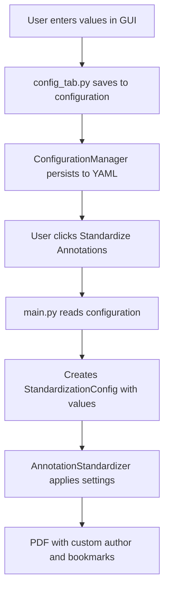

# Validation Settings - Complete Summary

## Overview

The Validation Settings tab now provides three configurable fields that control how PDF annotations are standardized:

| Setting | Purpose | Default | Since Version |
|---------|---------|---------|---------------|
| **Generic Author Name** | Author applied to all annotations | `Geron` | 1.1.0 |
| **Form Bookmark Label** | Label for form-based bookmark section | `Form_bookmarks` | 1.2.0 |
| **SDTM Bookmark Label** | Label for domain-based bookmark section | `SDTM` | 1.2.0 |

## Quick Access

**Location:** Configuration Tab → Validation Settings Sub-Tab

All three fields appear at the bottom of the Validation Settings section, below the "Ignore Variables" field.

## Why These Features Matter

### 1. Generic Author Name
- **Problem**: Hardcoded author name doesn't fit all organizations
- **Solution**: Configurable field allows each team to use appropriate author designation
- **Benefits**: 
  - Traceability (know who standardized the document)
  - Consistency (all annotations have same author)
  - Flexibility (different projects, different authors)

### 2. Form Bookmark Label
- **Problem**: "Form_bookmarks" might not match your organization's terminology
- **Solution**: Customizable label for form-based navigation
- **Benefits**:
  - Multilingual support
  - Match organization standards
  - Clearer navigation for users

### 3. SDTM Bookmark Label
- **Problem**: "SDTM" might be too technical or need localization
- **Solution**: Customizable label for domain-based navigation
- **Benefits**:
  - User-friendly terminology
  - Regulatory compliance
  - International support

## Common Use Cases

### Use Case 1: Multinational Organization
**Scenario**: Running trials in multiple countries with different languages

**Configuration:**
- French team:
  ```yaml
  generic_author_name: "Équipe de Données Cliniques"
  form_bookmark_label: "Formulaires"
  sdtm_bookmark_label: "Domaines SDTM"
  ```

- Spanish team:
  ```yaml
  generic_author_name: "Equipo de Datos Clínicos"
  form_bookmark_label: "Formularios"
  sdtm_bookmark_label: "Dominios SDTM"
  ```

- English team:
  ```yaml
  generic_author_name: "Clinical Data Team"
  form_bookmark_label: "Forms"
  sdtm_bookmark_label: "SDTM Domains"
  ```

### Use Case 2: Contract Research Organization (CRO)
**Scenario**: Working with multiple sponsors, need to brand documents

**Configuration for Sponsor A:**
```yaml
generic_author_name: "Acme Pharma CRO"
form_bookmark_label: "CRF_Pages"
sdtm_bookmark_label: "Data_Domains"
```

**Configuration for Sponsor B:**
```yaml
generic_author_name: "BioTech Solutions CRO"
form_bookmark_label: "Study_Forms"
sdtm_bookmark_label: "SDTM_Structure"
```

### Use Case 3: Academic Research Center
**Scenario**: Multiple investigators, want to identify who processed each document

**Configuration:**
```yaml
generic_author_name: "Dr. Smith Laboratory"
form_bookmark_label: "Data Collection Forms"
sdtm_bookmark_label: "CDISC Domains"
```

### Use Case 4: Simplified Terminology
**Scenario**: Internal team prefers simpler, non-technical language

**Configuration:**
```yaml
generic_author_name: "Data Team"
form_bookmark_label: "Forms"
sdtm_bookmark_label: "Domains"
```

## Configuration Workflow

### Initial Setup
1. Launch application
2. Go to Configuration → Validation Settings
3. Set your preferred values
4. Click "Save Configuration As..."
5. Name your config file (e.g., `acme_pharma_config.yaml`)
6. Done! Settings persist for all future sessions

### Project-Specific Configurations
You can maintain multiple configuration files:
- `config_french.yaml` - For French language PDFs
- `config_spanish.yaml` - For Spanish language PDFs
- `config_sponsor_a.yaml` - For Sponsor A projects
- `config_sponsor_b.yaml` - For Sponsor B projects

Load the appropriate config using "Load Configuration..." button.

### Team Standardization
Share your configuration file with team members:
1. Save your configuration
2. Share the `.yaml` file
3. Team members load it using "Load Configuration..."
4. Everyone uses the same settings!

## Technical Integration

### Configuration File Structure
```yaml
validation:
  ignore_domains: []
  ignore_variables: ['STUDYID', 'USUBJID']
  generic_author_name: "Your Author Name"
  form_bookmark_label: "Your Form Label"
  sdtm_bookmark_label: "Your SDTM Label"
```

### How It Works



### API Usage (For Developers)

```python
from sdtm_checker.core.annotation_standardizer import (
    AnnotationStandardizer, 
    StandardizationConfig
)

# Create custom configuration
config = StandardizationConfig(
    default_author="My Organization",
    form_bookmark_label="My Forms",
    sdtm_bookmark_label="My Domains"
)

# Use standardizer
standardizer = AnnotationStandardizer(config)
stats = standardizer.standardize_pdf(
    "input.pdf", 
    "output.pdf"
)
```

## Validation Rules

### Generic Author Name
- **Empty**: Falls back to "Geron"
- **Whitespace Only**: Falls back to "Geron"
- **Special Characters**: Most characters supported
- **Length**: No hard limit, but recommend < 100 characters
- **Unicode**: Full Unicode support (emoji, international characters)

### Bookmark Labels
- **Empty**: Fall back to defaults
- **Whitespace Only**: Fall back to defaults
- **Special Characters**: PDF-compatible characters supported
- **Length**: Recommend < 50 characters for usability
- **Duplicates**: Avoid using same label for both sections
- **Unicode**: Full Unicode support

## Best Practices

### ✅ Recommended

1. **Use descriptive names**
   - Good: "Clinical Data Management Team"
   - Avoid: "CDM" (too cryptic)

2. **Keep labels concise**
   - Good: "Forms", "CRF_Pages"
   - Avoid: "All_Clinical_Research_Forms_Used_In_This_Study"

3. **Match your organization's standards**
   - Use terminology from your SOPs
   - Align with regulatory submission requirements

4. **Test before production**
   - Try settings on a test PDF first
   - Verify bookmarks appear correctly in PDF viewer

5. **Document your choices**
   - Keep a record of which config is used for which project
   - Include config file in project documentation

### ❌ Avoid

1. **Very long names** (>100 chars for author, >50 for labels)
2. **Purely numeric values** (use descriptive text)
3. **Special PDF control characters**
4. **Duplicate labels** for both bookmark sections
5. **Frequent changes** (maintain consistency)

## Troubleshooting Guide

### Problem: Settings don't appear in confirmation dialog
**Diagnosis**: Configuration not saved  
**Solution**: Click "Save Configuration As..." after making changes

### Problem: Bookmarks show wrong labels in PDF
**Diagnosis**: Old configuration loaded  
**Solution**: Reload application or re-save configuration

### Problem: Can't see custom labels in PDF viewer
**Diagnosis**: Bookmarks panel not visible  
**Solution**: 
- Adobe: View → Navigation Panels → Bookmarks
- Others: Look for sidebar with bookmark icon

### Problem: Special characters display incorrectly
**Diagnosis**: Encoding issue  
**Solution**: Stick to alphanumeric and common punctuation

### Problem: Changes lost after restart
**Diagnosis**: Configuration not persisted  
**Solution**: Ensure you saved configuration before closing app

## Migration Guide

### From Version 1.0.x to 1.2.0

**What Changed:**
- Two new fields added to Validation Settings
- No breaking changes to existing functionality
- Existing configs work without modification

**Action Required:**
- **None** - Application uses sensible defaults
- **Optional** - Update your config to add new fields

**Updated Config Template:**
```yaml
validation:
  ignore_domains: []
  ignore_variables: ['STUDYID', 'USUBJID']
  generic_author_name: Geron           # Added in 1.1.0
  form_bookmark_label: Form_bookmarks  # Added in 1.2.0
  sdtm_bookmark_label: SDTM            # Added in 1.2.0
```

## Related Documentation

- [Generic Author Feature](GENERIC_AUTHOR_FEATURE.md) - Detailed author name docs
- [Bookmark Labels Feature](BOOKMARK_LABELS_FEATURE.md) - Detailed bookmark docs
- [Feature Changelog](FEATURE_CHANGELOG.md) - Version history
- [Validation Settings Quick Start](../VALIDATION_SETTINGS_QUICK_START.md) - Quick reference
- [User Guide](USER_GUIDE.md) - Complete application guide

## Support

For questions or issues:
1. Check this documentation
2. Review the Quick Start guide
3. Examine your `config/config.yaml` file
4. Check application logs in `logs/` directory

---

**Version**: 1.2.0  
**Last Updated**: October 11, 2025  
**Status**: Production Ready

